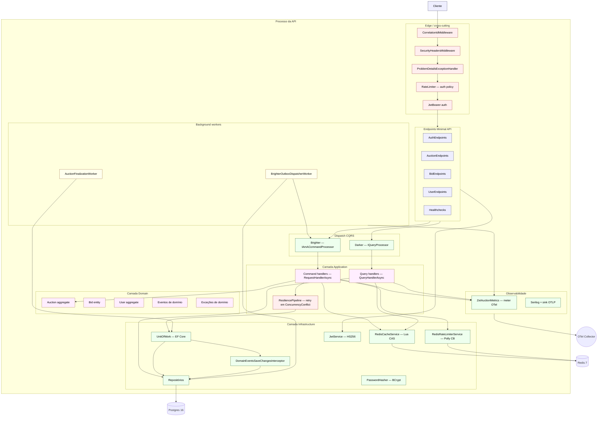

# C3 — Visão de componente (container API)

Dá um zoom dentro do container da API ZetAuction. Cada caixa é um
componente lógico; setas são chamadas de método in-process ou
dependências resolvidas via DI.

## Responsabilidades dos componentes

### Edge / cross-cutting

| Componente | Função |
| --- | --- |
| `CorrelationIdMiddleware` | Lê `X-Correlation-Id`, cai para o `traceparent` W3C, depois para um GUID novo. Empurra para o `LogContext` do Serilog |
| `SecurityHeadersMiddleware` | HSTS, CSP, framing/referrer/permissions policies em toda resposta |
| `ProblemDetailsExceptionHandler` | Mapeia exceptions de domínio para respostas RFC 7807 |
| `RateLimiter` | Fixed-window 5/5min por IP em `/api/v1/auth/*` |
| `JwtBearer` | Validação HS256 com `Jwt:SecretKey`; `ValidAlgorithms` fixo em HmacSha256 |

### Camada Application

Command handlers embrulham uma transação do UoW, participam do
pipeline Polly de retry (`PlaceBidCommandHandler`) e nunca publicam
domain events direto — o interceptor faz isso (ADR-0003).

Query handlers leem pelo caminho cache-first
(`GetHighestBidQueryHandler`) e emitem métricas de hit/miss.

### Camada Infrastructure

`UnitOfWork` traduz `DbUpdateConcurrencyException` para
`ConcurrencyConflictException`. O
`DomainEventsSaveChangesInterceptor` drena os eventos do aggregate,
mapeia cada um para uma `Paramore.Brighter.Message` (Topic = FQN,
Body = JSON, `Header.Bag["clr_type"]` = AssemblyQualifiedName) e
grava via `PostgreSqlOutbox.AddAsync` na mesma transação EF, usando
`EntityFrameworkPostgreSqlConnectionProvider` como bridge.

`RedisCacheService` roda um script Lua que só faz HSET quando o
amount recebido excede estritamente o valor armazenado (ADR-0004).

`RedisRateLimiterService` embrulha a chamada Redis em um circuit
breaker Polly que cai para um limiter in-memory em falha do Redis.

### Background workers

`AuctionFinalizationWorker` clama leilões vencidos sob
`FOR UPDATE SKIP LOCKED`, avança eles para `Finalized` e deixa o
interceptor escrever `AuctionClosedEvent` no outbox.

`BrighterOutboxDispatcherWorker` faz polling do `PostgreSqlOutbox`
via `OutstandingMessagesAsync`, deserializa o payload de volta para
o evento tipado (resolvendo via `Header.Bag["clr_type"]` e validando
contra `IDomainEvent.IsAssignableFrom`) e publica via
`IAmACommandProcessor.PublishAsync<T>`. Brighter v9.9.13 não usa
`FOR UPDATE SKIP LOCKED` nas linhas — para fechar a janela
multi-réplica, o worker pré-reivindica o `MessageId` na tabela
`processed_events` (`INSERT … ON CONFLICT DO NOTHING`) **antes** do
publish. A réplica que perde o claim pula o handler chain e ainda
chama `MarkDispatchedAsync`. Mensagens permanentemente falhas são
dead-lettered (forçadas para `Dispatched`) após 10 tentativas, com
métrica `zetauction.outbox.dead_lettered` para alerta (ADR-0003).
