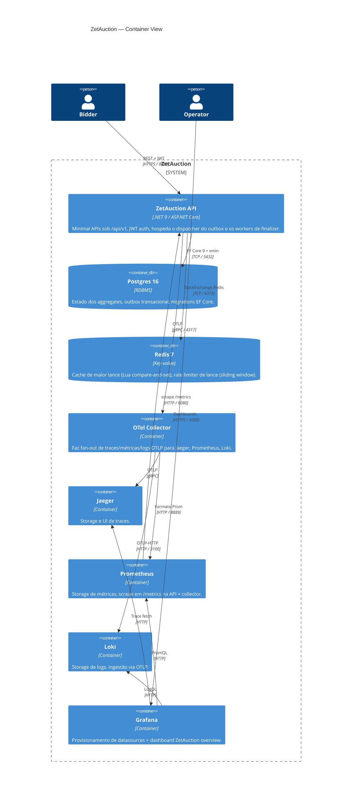

# C2 — Visão de container

Dá um zoom de um nível dentro da fronteira do sistema ZetAuction.
Cada caixa é uma unidade implantável; setas são protocolos de rede.

## O que mora onde

| Container | Construído de | Responsabilidades-chave |
| --- | --- | --- |
| **API** | `Dockerfile` | Superfície HTTP, dispatch de command/query, worker do dispatcher de outbox, worker do finalizer de leilão, emissores de observabilidade |
| **Postgres** | `postgres:16-alpine` | Fonte da verdade para aggregates e tabela do outbox |
| **Redis** | `redis:7-alpine` | Cache hot de leitura + rate limiter distribuído |
| **OTel Collector** | `otel/opentelemetry-collector-contrib` | Fan-out único para traces / métricas / logs |
| **Prometheus** | `prom/prometheus` | Scrape + storage. `/metrics` também é exposto direto pela API, então dashboards sobrevivem a um outage do Collector |
| **Loki** | `grafana/loki` | Logs |
| **Jaeger** | `jaegertracing/all-in-one` | Traces |
| **Grafana** | `grafana/grafana` | Dashboards (auto-provisionados de `infra/grafana/`) |

## Por que um único container API, não três

A API hospeda três responsabilidades (HTTP, dispatcher do outbox,
finalizer de leilão) dentro de um único processo. Poderíamos
separar, e num deployment muito maior nós separaríamos. Na escala de
hoje:

- Os três precisam do mesmo data context (EF Core + outbox).
- `FOR UPDATE SKIP LOCKED` (ADR-0003, finalizer) torna os workers
  seguros para rodar em toda réplica sem coordenação.
- Separar introduz superfície de deploy adicional sem ganho mensurável
  de correção ou performance.

Separar fica interessante quando bater em *qualquer um* destes:

- Latência de dispatch do outbox começar a competir com o budget de
  request da API.
- O finalizer precisar de characteristics de scaling diferentes do
  caminho HTTP (ex.: backlog após um outage).

O Helm chart (`chart/zetauction/`) é estruturado para conseguirmos
esculpir um Deployment separado para qualquer dos workers sem
re-conectar o runtime.
