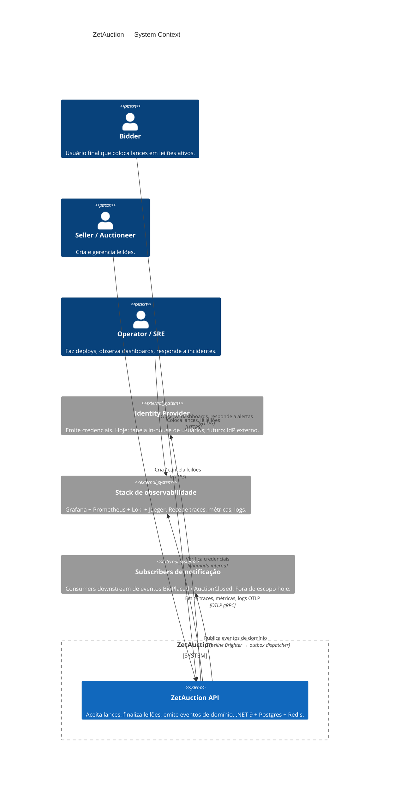

# C1 — Contexto do sistema

O domínio de leilão no nível mais alto de zoom. Caixas fora da
fronteira "ZetAuction" estão fora do escopo desse codebase mas
importam para o comportamento de runtime.

## Personas

| Persona | Objetivo |
| --- | --- |
| **Bidder** | Ver o preço atual, colocar um lance, ver o lance dele entrar antes do de outro |
| **Seller** | Criar um leilão, ver o tempo passar, descobrir quem ganhou |
| **Operator** | Detectar outage rápido, entender o que está degradado, seguir runbooks |

## Dependências externas

- **Identity Provider** é interno hoje (aggregate `User` +
  `LoginCommandHandler`). JWT é assinado com HS256; trocar por um IdP
  externo (ou virar para chave assimétrica) é uma mudança contida em
  `JwtService` + `AuthConfig`.
- **Stack de observabilidade** vem com o `docker-compose.yml` para o
  loop local. Produção troca pela stack da plataforma e reusa o
  contrato do endpoint OTLP.
- **Subscribers de notificação** não estão nesse repo. O outbox
  garante delivery at-least-once assim que um subscriber estiver
  conectado (rota Brighter, ver ADR-0003 / ADR-0006).
