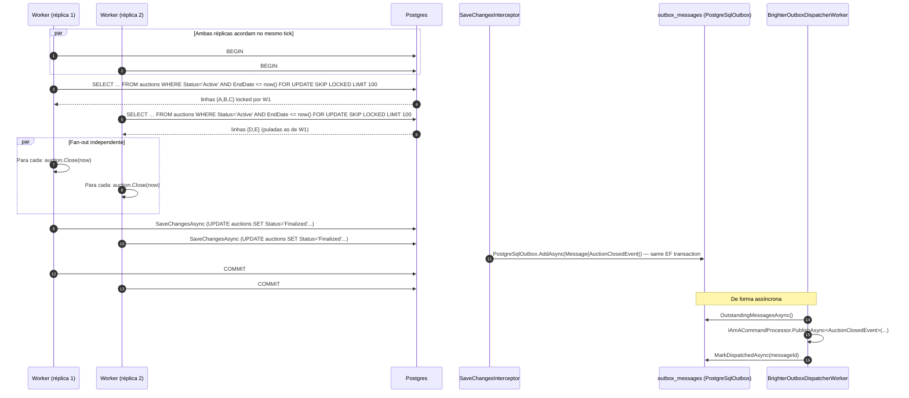

# Sequência — finalização do leilão

O worker de finalizer roda em toda réplica da API. Ele clama
leilões vencidos sob `FOR UPDATE SKIP LOCKED`, então múltiplas
réplicas nunca tentam finalizar a mesma linha.

## Por que `FOR UPDATE SKIP LOCKED`

Um `SELECT FOR UPDATE` ingênuo enfileira ambos os workers atrás do
mesmo rowset, batendo no propósito de rodar o worker em toda
réplica. O modificador `SKIP LOCKED` pede ao Postgres para passar
por linhas já locked por outra transação, então os workers
paralelizam naturalmente sem estado de coordenação no Redis ou em
memória.

## Modos de falha

- Se um worker crasha entre `SELECT FOR UPDATE` e `COMMIT`, o
  Postgres libera os locks no abort da transação. A próxima
  iteração do worker pega as linhas de volta.
- Se um worker crasha entre `COMMIT` e o dispatcher do outbox pegar
  as linhas novas, a tabela `outbox_messages` é durável (gerenciada
  pelo `Paramore.Brighter.Outbox.PostgreSql`), então os eventos
  ainda saem eventualmente.
- O intervalo é intencionalmente curto (5s quando idle) — o backlog
  é limitado pelo tempo entre `EndDate` e o próximo tick do worker.
