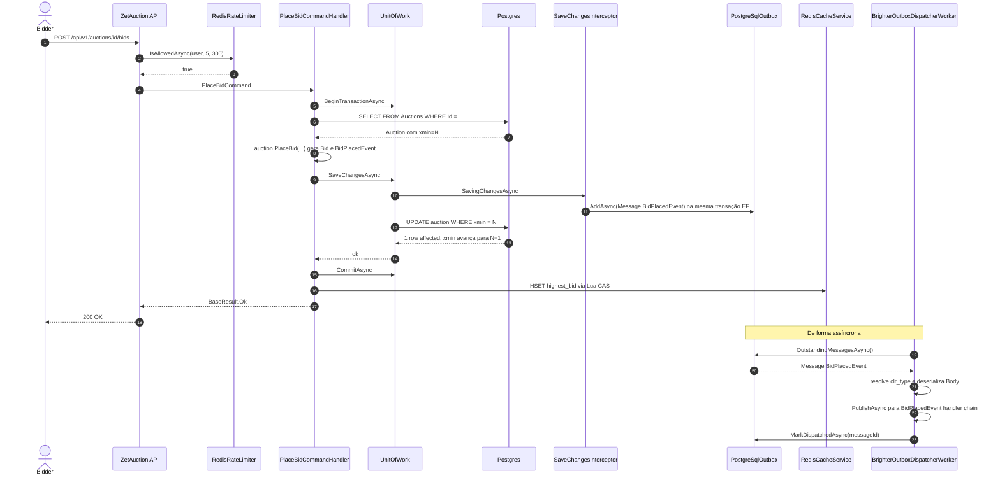
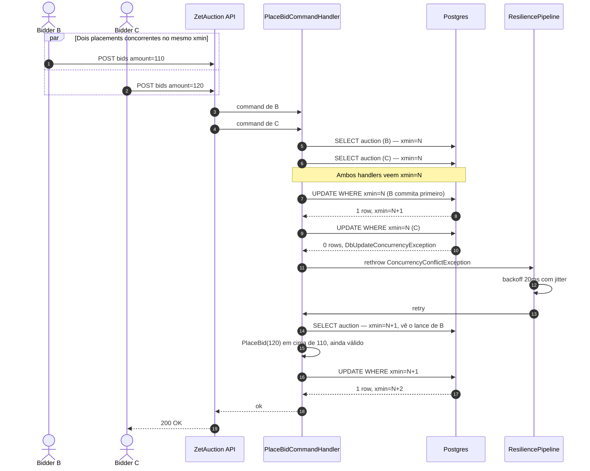

# Sequência — colocar lance

Dois cenários: o happy path e o caminho contendido onde o token de
optimistic concurrency força um retry.

## Happy path

## Caminho contendido (conflito de xmin, retry Polly)

## Notas

- O passo "B commita primeiro" é resolvido por contenção pelo MVCC
  do Postgres. As duas transações estão em vôo; quem terminar o
  UPDATE primeiro ganha.
- O retry no Polly reseta o change tracker do EF Core
  (`ResetTrackingAsync`), então a segunda tentativa relê o leilão
  com o novo xmin.
- Se o pipeline de retry queima as três tentativas, o
  `409 ConcurrencyConflict` original (RFC 7807) volta para o cliente
  — não um `500`.
- O counter `zetauction.db.concurrency_conflicts` incrementa em todo
  retry, dando ao Grafana visibilidade sobre contenção.
