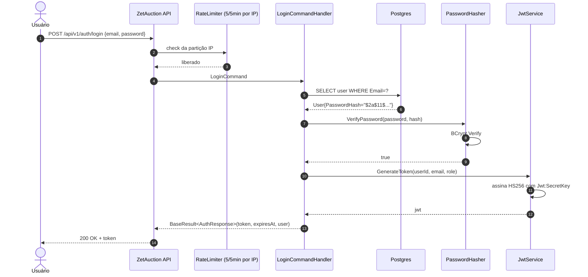

# Sequência — login

## Modos de falha

- **Senha errada.** `VerifyPassword` retorna `false`; handler
  retorna o deliberadamente vago "Invalid email or password" para
  não vazar qual metade está errada. O custo de verificação do
  BCrypt garante que o canal de tempo é dominado por trabalho de
  hash, não por branch-on-found.
- **Rate limit estourado.** `RateLimiter` retorna `429` com
  `Retry-After: 60` e um body RFC 7807 antes do handler ser
  invocado. Custo do BCrypt não é pago.
- **Outage do banco.** `LoginCommandHandler` falha rápido com o
  caminho padrão de outage Postgres `503`. Sem lógica de caso
  especial.
