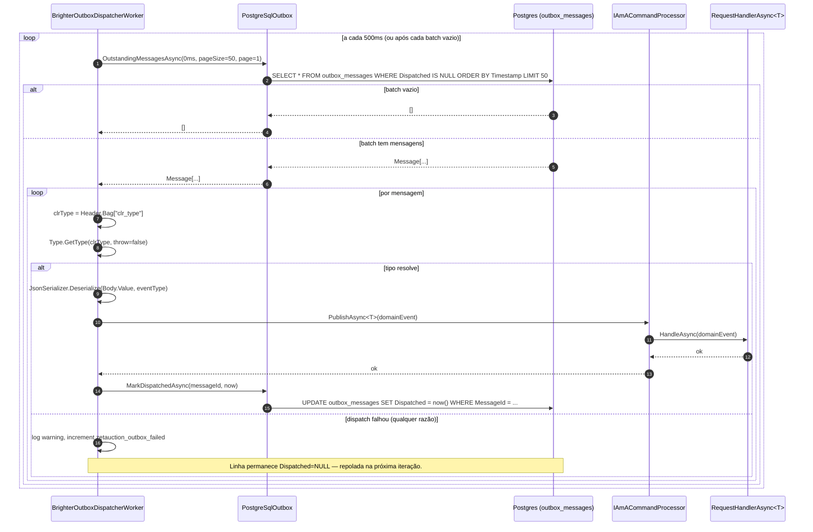

# Sequência — dispatch do outbox

Drena o outbox transacional do Brighter (`PostgreSqlOutbox` v9.9.13)
para o `IAmACommandProcessor` in-process. Roda em toda réplica
da API. Réplicas concorrentes podem ler a mesma linha antes do
`MarkDispatchedAsync` commit (`OutstandingMessagesAsync` é um
SELECT simples, não `FOR UPDATE SKIP LOCKED`) — handlers são
idempotentes por contrato (ver ADR-0003).

## Propriedades

- **Delivery at-least-once.** O `PostgreSqlOutbox` só marca a linha
  como dispatched depois do `PublishAsync` retornar com sucesso. Um
  crash entre `PublishAsync` e `MarkDispatchedAsync` deixa a linha
  outstanding — a próxima iteração pode redispatchar (handlers
  idempotentes absorvem o duplicate).
- **Idempotência por contrato.** Brighter v9.9.13 não tem
  `FOR UPDATE SKIP LOCKED` no outbox. Réplicas concorrentes podem
  ler a mesma linha. `BidPlacedEventHandler`,
  `AuctionClosedEventHandler` e `AuctionCancelledEventHandler` são
  side-effect-free (logging + reads). Novos handlers precisam manter
  a propriedade.
- **Resiliência de tipo.** Um `clr_type` ausente (skew de deployment)
  faz o dispatch falhar mas não abandona a linha — assim que o
  handler correspondente entra em produção, a mensagem drena.

## Runbook de falha

Ver `docs/runbooks/outbox-stuck-messages.md` para passos de triage
quando o counter de falhas sobe mais rápido que o de dispatched.
