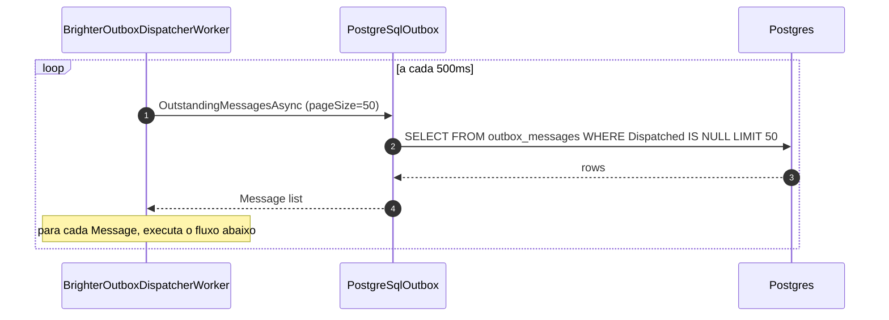
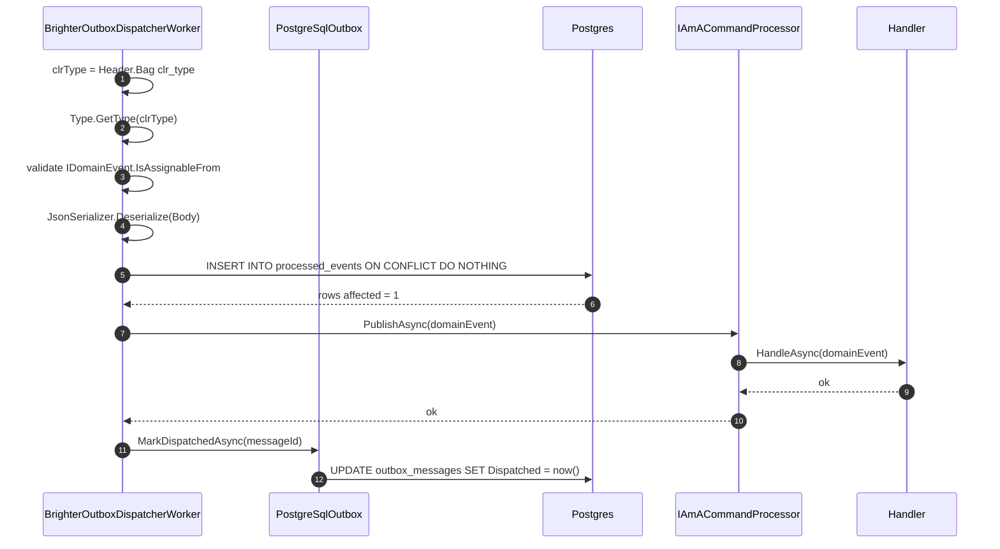
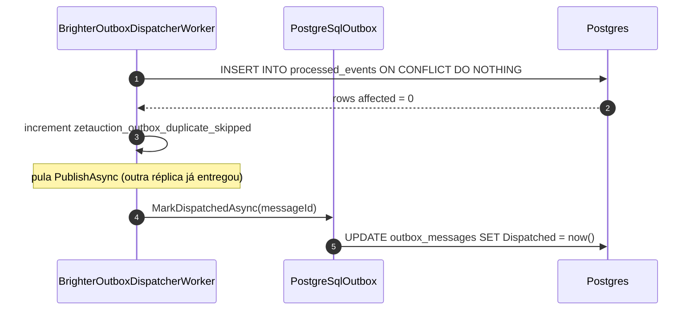
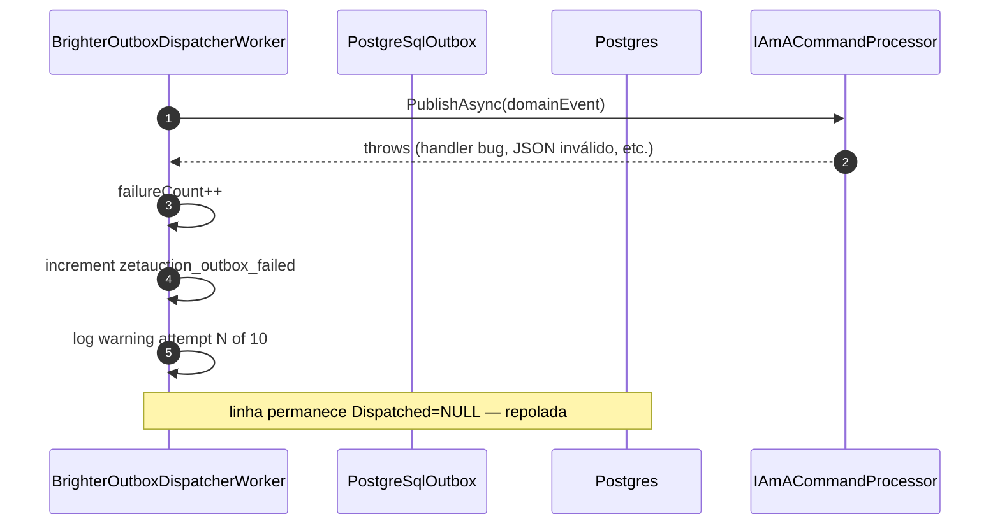
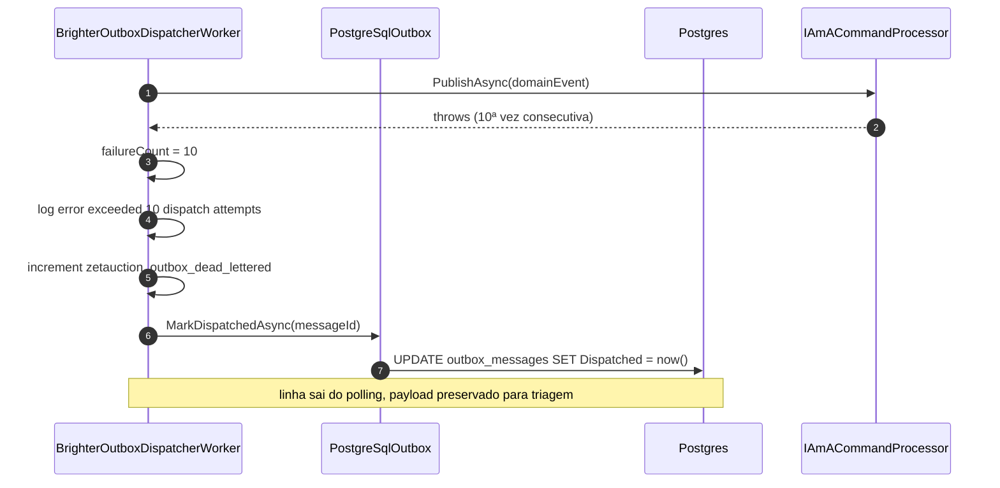

# Sequência — dispatch do outbox

Drena o outbox transacional do Brighter (`PostgreSqlOutbox` v9.9.13)
para o `IAmACommandProcessor` in-process. Roda em toda réplica
da API. Como `OutstandingMessagesAsync` é um SELECT simples (não
`FOR UPDATE SKIP LOCKED`), réplicas concorrentes podem ler a mesma
linha — para fechar essa janela, o worker pré-reivindica o
`MessageId` na tabela `processed_events` antes de publicar. Apenas
a réplica que ganha o INSERT roda o handler chain (ver ADR-0003).

## Polling loop

## Por mensagem — caminho de sucesso (réplica vence o claim)

## Por mensagem — réplica perde o claim (idempotência multi-réplica)

## Por mensagem — falha transiente (retry na próxima iteração)

## Por mensagem — poison message (dead-letter após 10 tentativas)

## Propriedades

- **Delivery at-least-once.** O `PostgreSqlOutbox` só marca a linha
  como dispatched depois do `PublishAsync` retornar com sucesso. Um
  crash entre `PublishAsync` e `MarkDispatchedAsync` deixa a linha
  outstanding — a próxima iteração re-tenta o pre-claim, encontra a
  linha em `processed_events` (0 rows), pula o publish (não duplica)
  e marca dispatched.
- **Handler at-most-once por evento.** A pré-reivindicação em
  `processed_events` (PRIMARY KEY em `event_id`,
  `INSERT ... ON CONFLICT DO NOTHING`) garante que apenas uma
  réplica entra no chain do handler para um dado `MessageId`, mesmo
  quando múltiplas réplicas selecionam a linha em paralelo. Novos
  subscribers não precisam implementar dedup própria.
- **Defesa em profundidade na deserialização.** O `clr_type` é
  primeiro resolvido por `Type.GetType(...)` e depois validado
  contra `IDomainEvent.IsAssignableFrom`. Tipo arbitrário injetado
  via write no banco é recusado pelo dispatcher antes do handler.
- **Poison-message dead-letter.** O worker mantém um
  `ConcurrentDictionary<Guid, int>` em memória. Após 10 tentativas
  falhas para a mesma `MessageId`, a linha é forçada para
  `Dispatched = now()` e a métrica
  `zetauction_outbox_dead_lettered_total` incrementa (alvo de
  alerta SEV-2). A linha **permanece** em `outbox_messages` com
  `Dispatched` populado para triagem.
- **Resiliência a deployment skew.** Um `clr_type` ausente faz o
  dispatch falhar **transiente** até a tentativa 10. Se o assembly
  certo entrar em produção dentro dessa janela, a mensagem drena
  normalmente; caso contrário, dead-letter.

## Métricas relacionadas

| Métrica | Significado |
| --- | --- |
| `zetauction_outbox_dispatched_total` | Mensagens drenadas com sucesso |
| `zetauction_outbox_failed_total` | Tentativas de dispatch que falharam (não inclui dead-letter) |
| `zetauction_outbox_duplicate_skipped_total` | Réplica perdeu o claim em `processed_events` |
| `zetauction_outbox_dead_lettered_total` | Linhas forçadas para dispatched após 10 falhas (poison) |

## Runbook de falha

Ver `docs/runbooks/outbox-stuck-messages.md` para passos de triage
quando o counter de falhas ou de dead-letter sobe.
